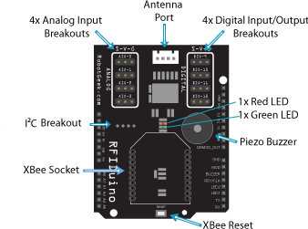

# RFIDuino Library for Arduino

You can install this library by copying the 'RFIDuino' folder into your 'libraries' folder.

Check out the [examples](RFIDuino/examples) to get get started!

### Pins Used by the RFIDuino 1.2
- Misc
  - Red LED (LED1): 8
  - Green LED (LED2): 4
  - Buzzer: 5
- EM4905
  - Ready Clock: 2
  - Demod: 2
  - Mod: 6
  - SHD (Sleep): 7
 
### Pins Available:
- Analog
  - 14-17
- Digital
  - 9-12
- 4-pin I²C Breakout
